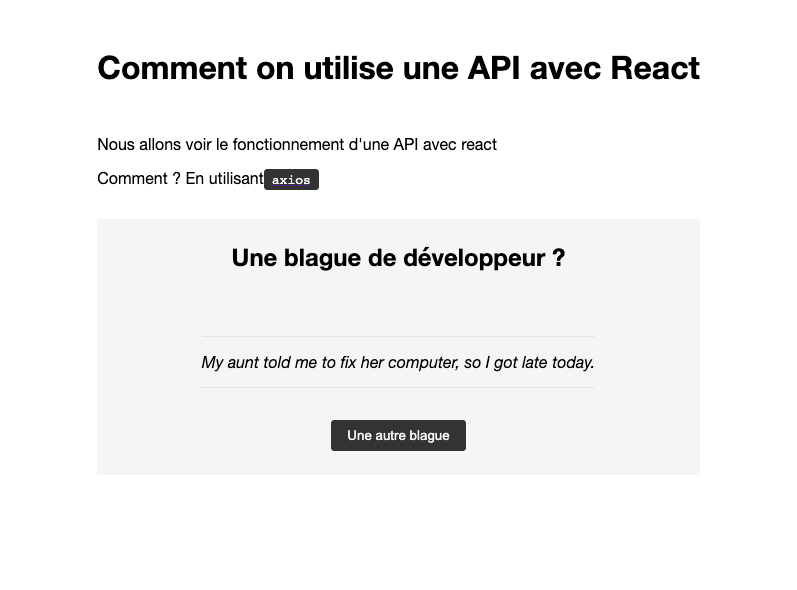

# Axios avec React

Nous allons ensemble faire un tp concernant la consomation d'une api avec le pacquage axios.

## Le but

A chaque fois que je clique sur le bouton, je souhaite avoir une nouvelle citation

